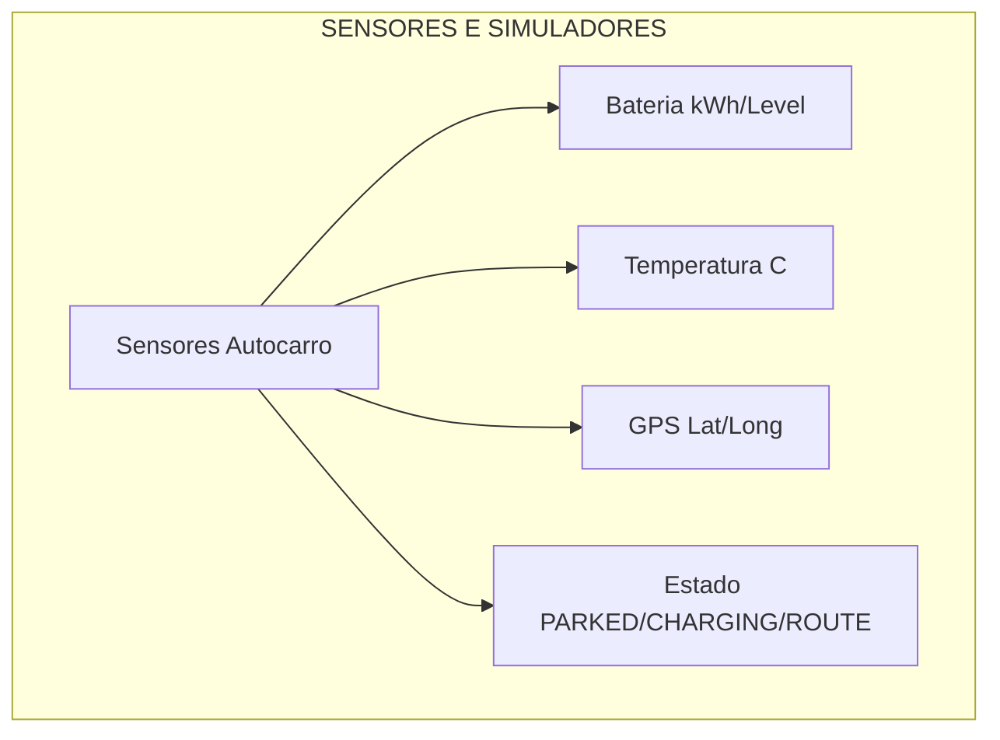
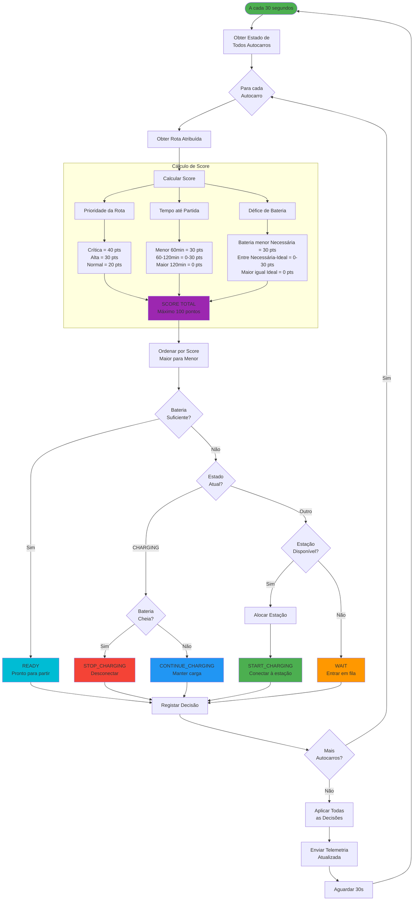
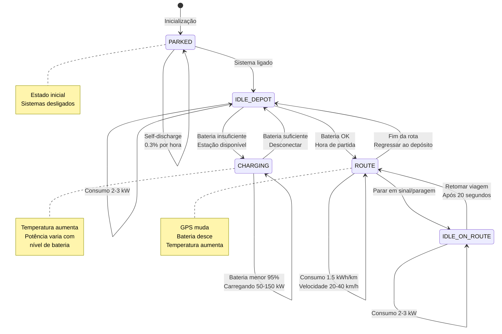
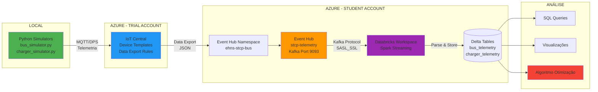

# STCP - Diagramas de Workflow

Sistema de Otimização de Carregamento de Autocarros Elétricos

---

## 1. Pipeline Completo do Sistema

Fluxo end-to-end desde sensores até decisões:


    
    subgraph "CLOUD - AZURE IoT CENTRAL"
        B[IoT Central<br/>Device Provisioning]
        B --> C[Data Export]
    end
    
    subgraph "STREAMING - EVENT HUB"
        C --> D[Event Hub<br/>Kafka Protocol]
        D --> D1[Partition 1<br/>stcp-telemetry]
    end
    
    subgraph "PROCESSAMENTO - DATABRICKS"
        D1 --> E[Spark Streaming]
        E --> F[Parse JSON]
        F --> G{Tipo Dispositivo?}
        G -->|BUS-*| H[Bus Telemetry]
        G -->|CS-*| I[Charger Telemetry]
        H --> J[(Delta Table<br/>bus_telemetry)]
        I --> K[(Delta Table<br/>charger_telemetry)]
    end
    
    subgraph "OTIMIZAÇÃO - ALGORITMO"
        L[Charging Scheduler]
        M[Ler Estado Atual]
        N[Calcular Score de Urgência]
        
        M --> N
        J -.Consulta.-> M
        K -.Consulta.-> M
        
        N --> O{Score >= 70?}
        O -->|Sim URGENTE| P[Prioridade Máxima]
        O -->|Não| Q{Score >= 50?}
        Q -->|Sim| R[Prioridade Alta]
        Q -->|Não| S[Prioridade Normal]
    end
    
    subgraph "DECISÕES"
        P & R & S --> T{Bateria<br/>Suficiente?}
        T -->|Não| U{Estação<br/>Disponível?}
        T -->|Sim| V[READY<br/>Pronto para rota]
        
        U -->|Sim| W[START_CHARGING<br/>Conectar estação]
        U -->|Não| X[WAIT<br/>Fila de espera]
    end
    
    style A fill:#4CAF50
    style B fill:#2196F3
    style D fill:#FF9800
    style E fill:#9C27B0
    style L fill:#F44336
```

---

## 2. Algoritmo de Decisão (Detalhado)

Lógica completa do otimizador:



---

## 3. Estados do Autocarro

Máquina de estados com todas as transições:



---

## 4. Arquitetura Azure

Componentes cloud e integrações:



---

## 5. Timeline de Eventos

Exemplo de execução ao longo do tempo:

```mermaid
gantt
    title STCP - Timeline de Carregamento e Rotas
    dateFormat HH:mm
    axisFormat %H:%M
    
    section BUS-001 (Rota-700)
    Carregamento      :active, b1c, 07:00, 1h
    Pronto            :b1r, 08:00, 30m
    Rota-700 (45km)   :crit, b1d, 08:30, 1.5h
    Regresso          :b1b, 10:00, 30m
    
    section BUS-002 (Rota-800)
    Pronto            :b2r, 07:00, 2h
    Rota-800 (38km)   :b2d, 09:00, 1.25h
    Regresso          :b2b, 10:15, 30m
    
    section BUS-003 (Rota-900)
    Carregamento      :active, b3c, 07:00, 45m
    Rota-900 (52km)   :crit, b3d, 07:45, 1.75h
    Regresso          :b3b, 09:30, 30m
    Carregamento      :active, b3c2, 10:00, 1h
    
    section Estações
    CS-001 ocupada    :active, c1, 07:00, 1h
    CS-002 disponível :done, c2, 07:00, 12h
    CS-003 ocupada    :active, c3, 07:00, 45m
    CS-003 ocupada    :active, c3b, 10:00, 1h
```



---

## Legenda

### Cores
- Verde: Componentes ativos/processamento
- Azul: Serviços cloud
- Laranja: Streaming de dados
- Roxo: Análise e transformação
- Vermelho: Decisões e otimização

### Estados do Sistema
- READY - Pronto para iniciar rota
- CHARGING - Em carregamento
- WAIT - Em fila de espera
- ROUTE - Em rota operacional
- PARKED - Estacionado no depósito

---

Projeto académico - STCP Bus Charging Optimization  
Fevereiro 2026
```
