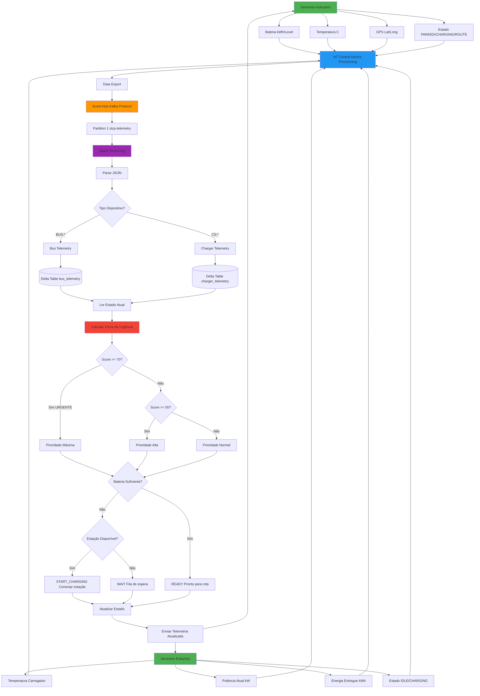

## 1. Pipeline Completo do Sistema

Fluxo end-to-end desde sensores até decisões:

```mermaid
graph TB
    A[Sensores Autocarro] --> A1[Bateria kWh/Level]
    A --> A2[Temperatura C]
    A --> A3[GPS Lat/Long]
    A --> A4[Estado PARKED/CHARGING/ROUTE]
    
    CS[Sensores Estações] --> CS1[Temperatura Carregador]
    CS --> CS2[Potência Atual kW]
    CS --> CS3[Energia Entregue kWh]
    CS --> CS4[Estado IDLE/CHARGING]
    
    A1 --> B[IoT Central Device Provisioning]
    A2 --> B
    A3 --> B
    A4 --> B
    CS1 --> B
    CS2 --> B
    CS3 --> B
    CS4 --> B
    
    B --> C[Data Export]
    C --> D[Event Hub Kafka Protocol]
    D --> D1[Partition 1 stcp-telemetry]
    
    D1 --> E[Spark Streaming]
    E --> F[Parse JSON]
    F --> G{Tipo Dispositivo?}
    G -->|BUS-*| H[Bus Telemetry]
    G -->|CS-*| I[Charger Telemetry]
    H --> J[(Delta Table bus_telemetry)]
    I --> K[(Delta Table charger_telemetry)]
    
    J --> M[Ler Estado Atual]
    K --> M
    M --> N[Calcular Score de Urgência]
    
    N --> O{Score >= 70?}
    O -->|Sim URGENTE| P[Prioridade Máxima]
    O -->|Não| Q{Score >= 50?}
    Q -->|Sim| R[Prioridade Alta]
    Q -->|Não| S[Prioridade Normal]
    
    P --> T{Bateria Suficiente?}
    R --> T
    S --> T
    
    T -->|Não| U{Estação Disponível?}
    T -->|Sim| V[READY Pronto para rota]
    
    U -->|Sim| W[START_CHARGING Conectar estação]
    U -->|Não| X[WAIT Fila de espera]
    
    W --> Y[Atualizar Estado]
    X --> Y
    V --> Y
    Y --> Z[Enviar Telemetria Atualizada]
    Z --> A
    Z --> CS
    
    style A fill:#4CAF50
    style CS fill:#4CAF50
    style B fill:#2196F3
    style D fill:#FF9800
    style E fill:#9C27B0
    style N fill:#F44336
```
